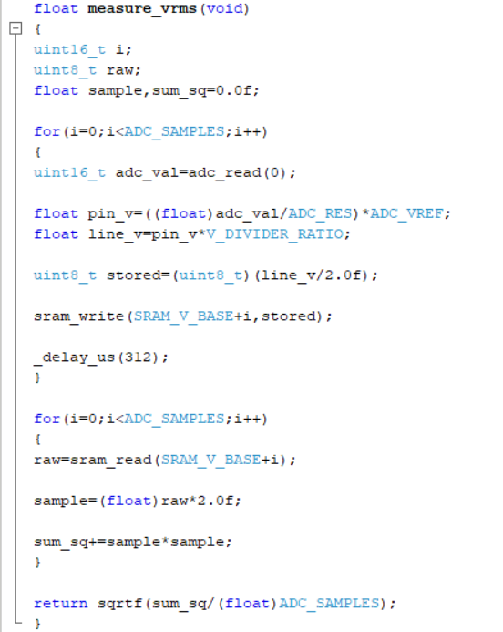
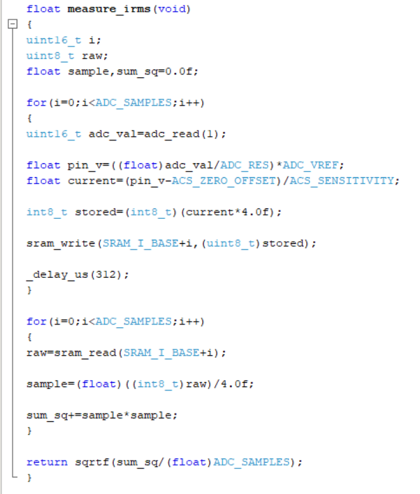
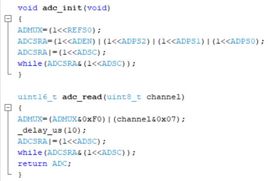
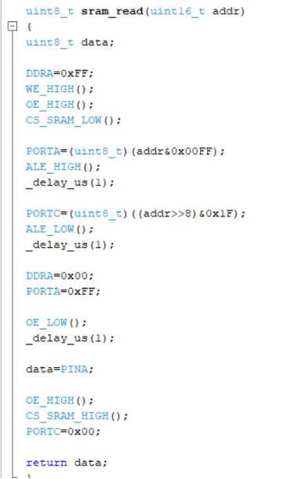
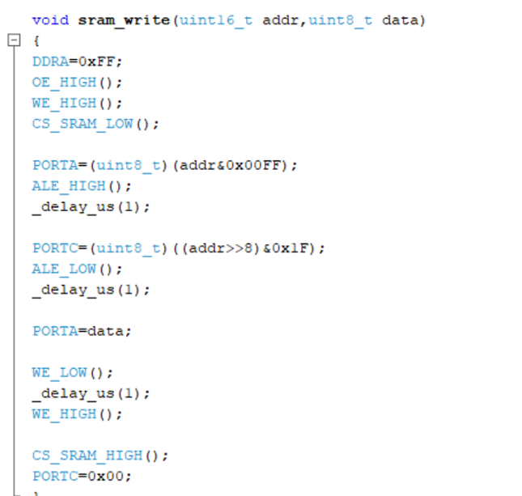
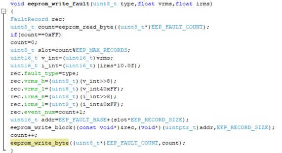
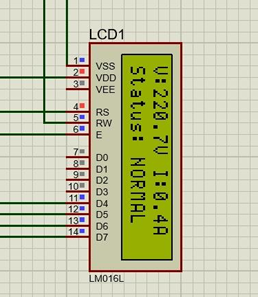
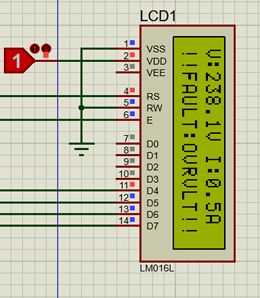
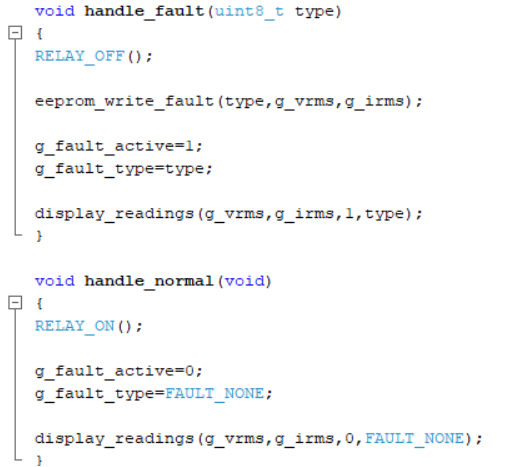
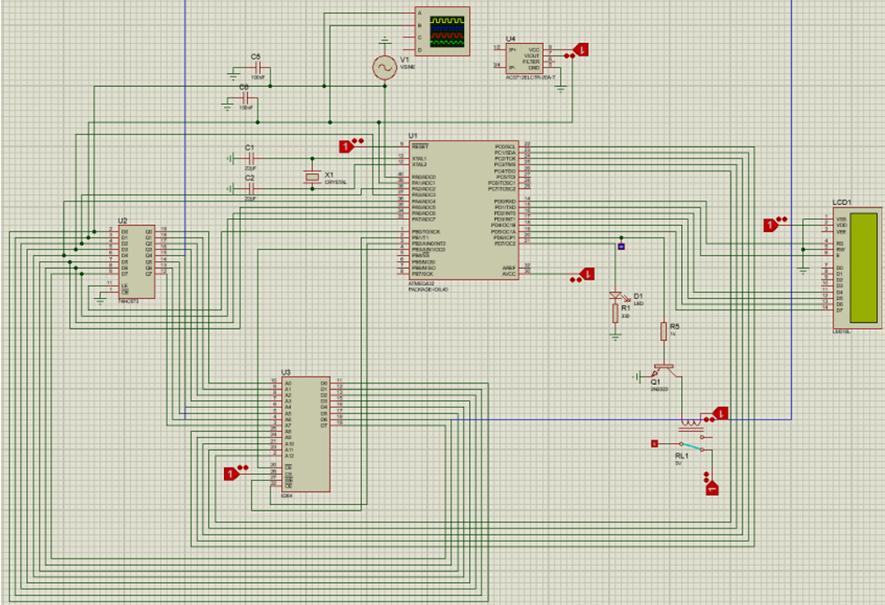

# Smart EV Charging Safety Controller

A microcontroller-based embedded safety system designed to monitor electric vehicle (EV) charging conditions in real time and autonomously disconnect charging during unsafe electrical events.

The system continuously measures voltage and current, computes RMS values from ADC samples, logs faults to EEPROM, buffers waveform data in SRAM, and provides real-time system feedback through an LCD interface.

Built entirely using **register-level AVR-GCC programming** on the **ATmega32 microcontroller** without Arduino frameworks or external abstraction libraries.

---

## Project Overview

Electric vehicle charging systems require continuous monitoring to ensure electrical safety and prevent equipment damage caused by:

- Overvoltage
- Voltage sag
- Overcurrent conditions

This project implements a standalone **EV Charging Safety Controller** capable of:

- Monitoring supply voltage and current in real time
- Computing RMS values from sampled signals
- Disconnecting charging through relay control during unsafe conditions
- Logging fault events into EEPROM
- Buffering waveform samples in SRAM
- Providing live system feedback on an LCD

The system was designed and simulated in **Proteus ISIS** and programmed in **AVR-GCC C** at the register level.

---

## Features

✔ Real-time voltage and current monitoring  
✔ RMS computation using ADC sampling  
✔ Automatic charger disconnection on unsafe conditions  
✔ EEPROM fault logging system  
✔ External SRAM waveform buffering  
✔ LCD-based live monitoring  
✔ Relay-based safety shutdown mechanism  
✔ Register-level AVR firmware development  
✔ Proteus-based verification and simulation

---

## System Architecture

The controller follows a modular embedded system architecture:

```text
Voltage Sensor ─────┐
                    │
Current Sensor ─────┤
                    ↓
              ATmega32 MCU
                    │
     ┌──────────────┼──────────────┐
     ↓              ↓              ↓
 External SRAM   EEPROM Fault     LCD Display
 (Wave Buffer)      Logging      System Status
                    ↓
               Relay Driver
                    ↓
           Charger Disconnect
```

---

## Project Objectives

The project was designed to:

- Monitor EV charging parameters in real time
- Compute RMS voltage and current values
- Detect unsafe charging conditions
- Disconnect charger automatically during faults
- Log fault records permanently
- Demonstrate external memory interfacing using SRAM and EEPROM
- Implement firmware entirely in AVR-GCC C without high-level libraries

---

## Hardware Components

| Component | Purpose |
|-----------|---------|
| ATmega32 MCU | Main controller |
| ACS712-20A | Current sensing |
| 74HC573 Latch | Address demultiplexing |
| 6264 SRAM | Waveform sample buffering |
| EEPROM | Fault event logging |
| 16×2 LCD | Real-time display |
| 2N2222 Transistor | Relay driver |
| SPDT Relay | Charger disconnect |
| Crystal Oscillator | MCU clock source |
| 1N4148 Diode | Flyback protection |

---

## Software & Tools

- AVR-GCC (Embedded C)
- Atmel Studio 7
- Proteus ISIS Professional
- USBasp Programmer

---

## Working Principle

The system continuously monitors charging conditions through sensor sampling and embedded decision-making.

### Step 1 — Voltage Monitoring

The charging voltage is sensed through a resistive divider and sampled using the ADC.

In hardware:

```text
220V AC → Transformer → Divider → ADC
```

The measured ADC values are converted into real-world voltage values.



---

### Step 2 — Current Monitoring

Load current is measured using the **ACS712 Hall-effect current sensor**.

The sensor output is sampled by the MCU ADC and converted into current values.

Current calculation:

```text
I = (Vpin − 2.5) / 0.1
```

This enables real-time monitoring of charging current.



---

### Step 3 — RMS Computation

The controller computes RMS values using:

- **64 ADC samples**
- Sum-of-squares method
- Approximate one full AC cycle

Formula:

```text
Xrms = √[(1/N) × Σ(xᵢ²)]
```

This provides accurate measurements for fault detection.



---

### Step 4 — SRAM Buffering

Voltage and current samples are temporarily stored in external **6264 SRAM**.

Because the ATmega32 lacks a dedicated external memory controller, memory access is manually implemented using:

- PORTA → multiplexed address/data bus
- PORTC → upper address bus
- 74HC573 latch → address demultiplexing

This demonstrates low-level memory bus interfacing.





---

### Step 5 — EEPROM Fault Logging

Whenever unsafe conditions occur, fault records are permanently written into EEPROM.

Stored data includes:

- Fault type
- Voltage value
- Current value
- Event counter

The system supports persistent fault history and circular storage.



---

### Step 6 — LCD Monitoring

The **16×2 LCD** provides live system feedback.

Example display:

```text
V:220.4V I:9.8A
Status: NORMAL
```

During faults:

```text
!!FAULT:OVRVLT!!
```





---

### Step 7 — Relay Protection Mechanism

A relay driver circuit disconnects charging automatically during unsafe electrical conditions.

Safety triggers:

| Fault Type | Threshold |
|------------|------------|
| Overvoltage | >225V |
| Voltage Sag | <215V |
| Overcurrent | >20A |

If a fault occurs:

1. Relay disconnects charger  
2. EEPROM logs event  
3. LCD displays warning  
4. Monitoring continues



---

## Proteus Simulation

The complete system was simulated in **Proteus ISIS** to verify:

- ADC sampling
- Relay switching
- LCD updates
- SRAM communication
- EEPROM logging
- Fault recovery behavior

The firmware HEX file was loaded into the ATmega32 and tested against multiple simulated fault conditions.



---

## Experimental Results

### Normal Operation

LCD output:

```text
V:220.4V I:9.8A
Status: NORMAL
```

Behavior:

- Relay ON
- Charging active
- Live monitoring enabled

### Fault Operation

Example:

```text
Overvoltage detected
```

Behavior:

- Relay OFF
- Charger disconnected
- EEPROM log written
- LCD fault alert displayed

---

## Results Summary

| Parameter | Result |
|-----------|--------|
| Voltage Monitoring | Successful |
| Current Monitoring | Successful |
| RMS Computation | Successful |
| EEPROM Logging | Successful |
| Relay Safety Shutdown | Successful |
| LCD Feedback | Successful |
| Proteus Verification | Successful |

---

## Engineering Concepts Demonstrated

- Embedded Systems
- AVR Microcontroller Programming
- Register-Level Embedded C
- ADC Interfacing
- SRAM Interfacing
- EEPROM Memory Management
- LCD Interfacing
- Relay Driver Circuits
- Fault Detection Systems
- RMS Computation
- Embedded Safety Systems
- Real-Time Monitoring
- Microprocessor Systems
- Hardware-Software Integration

---

## Future Improvements

Potential enhancements include:

- UART fault log retrieval
- Wireless monitoring
- Mobile dashboard integration
- RTC timestamp logging
- Multi-phase charging support
- Cloud logging
- Smart charger analytics

---

## Project Outcome

The Smart EV Charging Safety Controller successfully demonstrated a complete embedded protection system for EV charging applications. The project achieved real-time monitoring, fault detection, relay-based shutdown, EEPROM logging, and external memory interfacing while reinforcing low-level embedded firmware development and hardware integration concepts.

---

## Author

**Muhammad Bilal Chaudhry**  
Electrical Engineering — NUST
